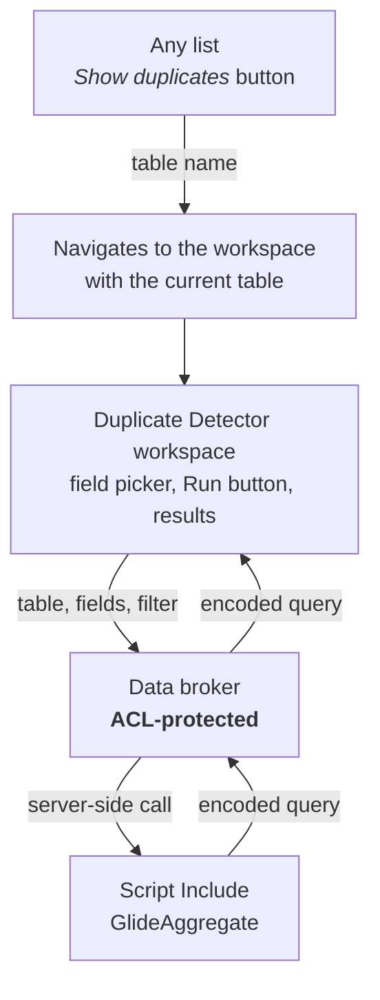

# Duplicate Detector (Fluent)

A ServiceNow application that finds duplicate records on any table and opens them in a dedicated workspace.

From any list, a **Show duplicates** button opens the workspace for that table. Pick the field(s) that should be unique, click **Run**, and see every record that belongs to a duplicate group.

- **Scope:** `x_916323_duplicate`
- **Version:** 1.0.0

## Architecture



The workspace never talks to the server logic directly — every call goes through an ACL-protected data broker.

## Installation

```bash
npm install

npx @servicenow/sdk auth --add https://<instance>.service-now.com --type basic --alias <alias>

npm run build
npm run deploy
```

## Configuration

**Role.** Everything is gated by a single role, `x_916323_duplicate.duplicate_viewer`:

- it controls who may run a duplicate search, and
- it controls who sees the **Show duplicates** button on lists.

Grant it to whoever should be able to hunt duplicates. `admin` bypasses the restriction.

**Where the button appears.** It's registered on the `global` table, so it shows up on **every list**, for users holding the role. To restrict it, set the action's **Table** to a specific table — or create one assignment per table.

## Usage

1. Open any list (e.g. **Users**). Filter it if you only want to check a subset — the current filter carries over.
2. Click **Show duplicates**. The workspace opens for that table.
3. Select the field(s) that should be unique. Several fields means duplicates on the **combination**.
4. Click **Run**. The list shows every record belonging to a duplicate group.

## Limitations

- **Read access is required on the target table.** If a table denies read access from other scopes, no duplicates are reported (and a warning is logged).
- **No persistence.** Nothing is stored: no table, no history, no scheduled scan. It *finds* duplicates, it does not resolve them.
- **Empty values group together.** Records with an empty value in a grouped field count as duplicates of one another.
- **Large result sets are truncated** at 5 000 records, with a warning in the logs.
- **Reference fields group by `sys_id`**, not by display value.
