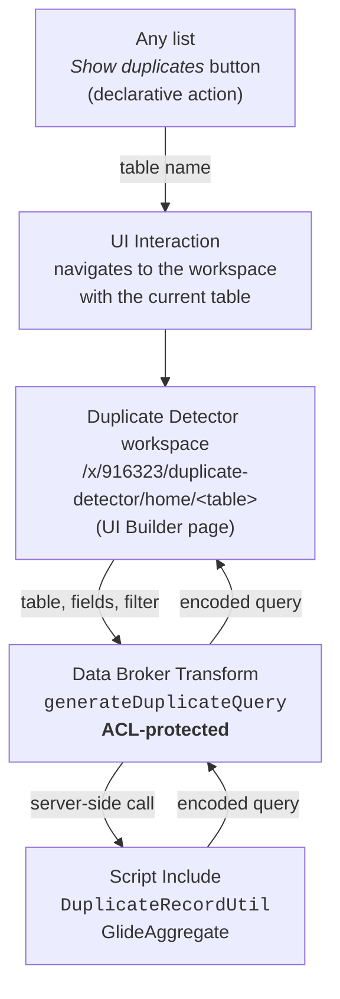

# Duplicate Detector (Fluent)

A ServiceNow **scoped application**, written entirely in **[ServiceNow Fluent](https://docs.servicenow.com/bundle/latest-release-notes/page/build/servicenow-sdk/concept/fluent-overview.html)**, that finds duplicate records on any table and opens them in a dedicated workspace.

From any list in the platform, a **Show duplicates** button opens the Duplicate Detector workspace for that table. You pick the field or fields that should be unique, click **Run**, and the workspace lists every record that belongs to a duplicate group.

- **Scope:** `x_916323_duplicate`
- **Version:** 1.0.0
- **Stack:** [ServiceNow SDK](https://www.npmjs.com/package/@servicenow/sdk) / Fluent — no raw XML, every record is defined as TypeScript

> This is a source-equivalent rewrite of the original [XML-based `duplicate-detector`](https://github.com/j0hn2608/duplicate-detector) application. Same 18 records, same behavior — expressed as `.now.ts` Fluent definitions instead of update-set XML, produced with `now-sdk transform`.

---

## Objective

Duplicate data is usually hunted down with one-off reports or throwaway background scripts. This application makes the check repeatable and self-service:

- works on **any table**, chosen at runtime — nothing to configure per table;
- detects duplicates on a **single field** (e.g. `email`) or on a **combination of fields** (e.g. `first_name` + `last_name`);
- returns the duplicate **records** themselves, not just counts, so they can be reviewed and merged;
- groups **in the database** (`GlideAggregate` with a `HAVING` clause), not in script, so it holds up on large tables.

## Architecture



The data broker is the **only** path from the browser to the server. The Script Include is not client-callable: the browser cannot reach it directly, only through the ACL-protected broker.

## Components

18 records, all in scope `x_916323_duplicate`, each expressed as its own `.now.ts` Fluent file.

| Component | Type | Fluent source |
|---|---|---|
| `DuplicateRecordUtil` | Script Include | [`server-development/script-include/...now.ts`](src/fluent/generated/server-development/script-include/sys_script_include_0418037899938385cd6d0509e89651c7.now.ts) + [`.server.js`](src/fluent/generated/server-development/script-include/sys_script_include_0418037899938385cd6d0509e89651c7.server.js) |
| `generateDuplicateQuery` | Data Broker Transform | [`other/sys-ux-data-broker-transform/...now.ts`](src/fluent/generated/other/sys-ux-data-broker-transform/sys_ux_data_broker_transform_bae3ca80241583570c6be75c9b9a3d4e.now.ts) |
| `show_duplicates` | Declarative Action Assignment | [`other/sys-declarative-action-assignment/...now.ts`](src/fluent/generated/other/sys-declarative-action-assignment/sys_declarative_action_assignment_4da806525b064d07422941250fdc17b0.now.ts) |
| `Show duplicates` | UI Interaction | [`other/sys-ui-interaction/...now.ts`](src/fluent/generated/other/sys-ui-interaction/sys_ui_interaction_1131d47a920e0c440da832a5ab767d42.now.ts) |
| `Home` | Macroponent | [`other/sys-ux-macroponent/...now.ts`](src/fluent/generated/other/sys-ux-macroponent/sys_ux_macroponent_5a7a74c8d0a7fdd54bf926b291de5444.now.ts) |
| `Home` | Screen + Screen Type | [`other/sys-ux-screen/...now.ts`](src/fluent/generated/other/sys-ux-screen/sys_ux_screen_274b9a5a7d968e906c5df6a24bf8566e.now.ts), [`other/sys-ux-screen-type/...now.ts`](src/fluent/generated/other/sys-ux-screen-type/sys_ux_screen_type_f8979af59cbd296da05355b9cb261171.now.ts) |
| `Home` | App Route | [`other/sys-ux-app-route/...now.ts`](src/fluent/generated/other/sys-ux-app-route/sys_ux_app_route_91419679f83ef05e84c3652d93f1a529.now.ts) |
| Client behavior | UX Client Scripts (×2) | [`other/sys-ux-client-script/...now.ts`](src/fluent/generated/other/sys-ux-client-script) |
| Field/table pickers | Page Properties (×2) | [`other/sys-ux-page-property/...now.ts`](src/fluent/generated/other/sys-ux-page-property) |
| `Duplicate Detector` | UX App Config | [`user-interface/ux-app-configuration/...now.ts`](src/fluent/generated/user-interface/ux-app-configuration/sys_ux_app_config_8210f1c49af8331b92d33a087d7181fb.now.ts) |
| `Duplicate Detector` | Page Registry (workspace entry) | [`user-interface/workspace/...now.ts`](src/fluent/generated/user-interface/workspace/sys_ux_page_registry_805a07497b1e85a62d00832a45b0a62e.now.ts) |
| `duplicate_viewer` | Role | [`security/role/...now.ts`](src/fluent/generated/security/role/sys_user_role_81518b6a59a68731d1fcaa886657868e.now.ts) |
| ACL | Security | [`security/access-control/...now.ts`](src/fluent/generated/security/access-control/sys_security_acl_ad74fca000540fc64f065ec6fb3d780c.now.ts) (restricts the data broker to `duplicate_viewer`, `admin` bypasses) |
| App definition | scope/name/description | [`now.config.json`](now.config.json) |

### The core logic

`DuplicateRecordUtil` is a small library. The table and the base filter are the *context* of a search, so they are given once at construction; the fields vary per call.

```javascript
var finder = new x_916323_duplicate.DuplicateRecordUtil('sys_user', 'active=true');

// Always check the precondition: a scoped application cannot read every table,
// and "no access" must never be mistaken for "no duplicates".
if (finder.canRun()) {

    // Groups of records sharing the same email
    finder.findDuplicates('email');
    // -> [{ values: { email: 'a@b.com' }, count: 3 }, ...]

    // Groups sharing the same first AND last name
    finder.findDuplicates(['first_name', 'last_name']);

    // Encoded query selecting every record that belongs to a duplicate group
    finder.buildDuplicateQuery('email');
    // -> { query: 'active=true^emailINa@b.com,c@d.com', groups: 2, truncated: false }
}
```

`buildDuplicateQuery` returns `sys_idISEMPTY` — a query that matches nothing — when there is no duplicate, so callers never have to special-case an empty result.

Responsibilities are deliberately kept apart: `_aggregate` and `_resolveSysIds` are the only methods that touch the database, `_encode` is pure string work, and `canRun` states the preconditions.

**A note on encoded queries.** They have no escaping mechanism: a value containing `^` or `,` cannot be expressed in one. Groups whose values are affected are resolved to concrete `sys_id`s instead — in a single query — while the rest keep the cheap value-based form. Only the affected groups pay that cost.

## Why Fluent instead of XML

This project was converted from the original XML update-set application using the ServiceNow SDK's `transform` command:

```bash
npx @servicenow/sdk init --from <path-to-legacy-app>   # stages the XML under metadata/
npx @servicenow/sdk transform --from .                  # converts XML -> .now.ts, removes the XML
```

Benefits over raw XML:

- **Readable diffs.** A code review on a `.now.ts` file reads like a review of any other TypeScript change; an XML diff on `sys_ux_*` records does not.
- **Type-checked builds.** `now-sdk build` validates references (e.g. a data broker pointing at a script include) before anything reaches the instance.
- **Two-way sync.** Changes made in-instance (Studio, UI Builder) can be synced back into these same source files instead of being reverse-engineered from an update set.

## Installation

This is a **ServiceNow SDK / Fluent project** — no update set to import, no XML to commit.

```bash
npm install

# one-off: authenticate against the target instance
npx @servicenow/sdk auth --add https://<instance>.service-now.com --type basic --alias <alias>

npm run build     # compile src/fluent -> dist/
npm run deploy    # install the built package on the instance (-a <alias> to target a specific one)
```

> **Scope note.** The scope prefix (`916323`) is tied to the **vendor/developer account** that originally reserved it (`glide.appcreator.company.code`), not to the target instance's PDI number. Deploying this same app to a different instance does **not** require rescoping — that's exactly how ISV apps show up with their own prefix on every client instance they're installed on. Only rescope if you are deliberately forking the app under your own vendor account.

## Configuration

**Role.** Everything is gated by a single role, `x_916323_duplicate.duplicate_viewer`:

- it controls who may execute the `generateDuplicateQuery` data broker (ACL), and
- it controls who sees the **Show duplicates** button on lists.

Grant it to the groups that should be able to hunt duplicates. `admin` bypasses the ACL.

**Where the button appears.** The declarative action is registered on the `global` table, so the button appears on **every list in the platform**, for users holding the role. To restrict it, edit the `show_duplicates` declarative action assignment and set its **Table** to a specific table — or create one assignment per table.

## Usage

1. Open any list (e.g. **Users**). Filter it if you only want to check a subset — the current list filter is carried over as the initial query.
2. Click **Show duplicates**. The workspace opens for that table.
3. Select the field or fields that should be unique. Selecting several fields looks for records that are duplicated on the **combination** of those fields.
4. Click **Run**. The list shows every record belonging to a duplicate group.

<!--
Screenshots of the workspace (list view with "Show duplicates" button, field picker, results) go here.
Log into the target instance and capture:
  1. The "Show duplicates" button on a list
  2. The field/table picker in the workspace
  3. A results list showing a duplicate group
-->

## Limitations

- **Read access is required on the target table.** As a scoped application, it can only aggregate tables that allow read access from other scopes. If a table denies it, `canRun()` returns false, a warning is logged (`[DuplicateDetector] Read access denied…`) and no duplicates are reported.
- **No persistence.** The application stores nothing: no table, no history, no scheduled scan. Every run is a live query, and nothing is merged automatically — it *finds* duplicates, it does not resolve them.
- **Empty values group together.** Records with an empty value in a grouped field count as duplicates of one another. Use the list filter (e.g. `emailISNOTEMPTY`) to exclude them.
- **Large result sets are truncated** at 5 000 records (`MAX_SYS_IDS`) on the `sys_id` path, with a warning in the logs.
- **Reference fields group by `sys_id`**, not by display value.
